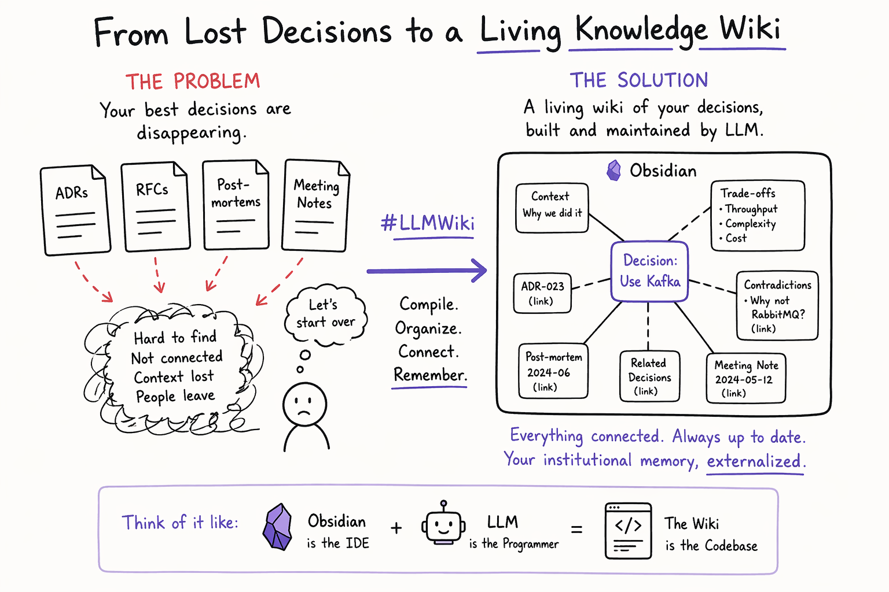

<div align="center">

# 🧠 LLM Wiki

**Your decisions, trade-offs, and lessons learned — compiled into a knowledge graph that actually compounds.**

[](LICENSE)
[](https://claude.ai/code)
[](https://obsidian.md)
[](https://daringfireball.net/projects/markdown/)



</div>

---

## Table of Contents

1. [The Problem](#the-problem)
2. [What It Does](#what-it-does)
3. [Demo](#demo)
4. [Who This Is For](#who-this-is-for)
5. [Quickstart](#quickstart)
6. [Architecture](#architecture)
7. [Directory Structure](#directory-structure)
8. [Compatible Tools](#compatible-tools)
9. [Why This Is Different](#why-this-is-different)

---

## The Problem

Most "chat with your docs" tools use RAG: you ask a question, the system finds relevant
chunks, the LLM answers — and forgets everything next time.

Your ADRs, RFCs, meeting transcripts, and post-mortems sit in separate folders, never
cross-referenced, never synthesized. When someone asks "why did we choose Kafka?" you dig
through three documents and piece it together from memory. When a new RFC contradicts a
six-month-old ADR, nobody notices until production breaks.

The knowledge is there. It's just never been compiled.

---

## What It Does

Drop source documents into `raw/`. Claude reads them, compiles a structured wiki, maintains
cross-links, flags contradictions, and files query answers back — so your knowledge compounds
instead of starting from scratch on every question.

```text
Input:  ADRs, RFCs, transcripts, post-mortems, PRDs, strategy docs
Output: An interlinked wiki with decisions, concepts, entities, contradiction flags,
        and a queryable synthesis layer
```

| Feature | How it works |
| --- | --- |
| **No RAG, no vector DB** | Just Claude + markdown + Obsidian — no infrastructure to deploy |
| **Domain-specific schema** | Templates for decisions, concepts, entities, and syntheses |
| **Contradiction detection** | When a new source challenges an old decision, both sides are flagged |
| **Compounding answers** | Query results file back as wiki pages — future queries draw on them |
| **Fully local** | Your data stays on disk; only Claude API calls leave your machine |
| **Obsidian-native** | Graph View visualizes every `[[wikilink]]` as a knowledge edge |

---

## Demo

### After ingesting one ADR

Running `/wiki-ingest raw/adrs/adr-0001-choose-messaging-platform.md` produces:

```text
Pages created:
  wiki/decisions/choose-async-messaging-platform.md
  wiki/concepts/event-driven-architecture.md
  wiki/concepts/dead-letter-queue.md
  wiki/entities/apache-kafka.md
  wiki/entities/rabbitmq.md
  wiki/entities/platform-team.md

Pages updated:
  wiki/index.md        — 6 new entries with TLDRs
  wiki/overview.md     — first synthesis paragraph written
  wiki/log.md          — operation logged

Contradictions found: 0
```

Each page is cross-linked — the decision page links to the concepts it applies, the entities
involved, and the raw source it was compiled from. Open the vault in Obsidian and the Graph
View lights up immediately.

### Querying the compiled wiki

```text
> /wiki-query "Why did we choose Kafka over RabbitMQ?"

Based on [[choose-async-messaging-platform]] and [[event-driven-architecture]]:

We chose Apache Kafka for domain events because the order processing pipeline
needed replay capability and the ability to add new consumers without touching
producers. RabbitMQ was retained for task queues (email, PDF generation) where
work-queue semantics are needed.

The accepted trade-off was operational complexity in exchange for replay and
decoupled consumers (source: adr-0001-choose-messaging-platform.md).

→ Filed as wiki/syntheses/why-kafka-over-rabbitmq.md
```

The filed synthesis becomes first-class wiki content — future queries can cite it.

---

## Who This Is For

| Role | What you'd drop in `raw/` | What you'd query |
| --- | --- | --- |
| **Solution Architect** | ADRs, RFCs, vendor evaluations, integration designs | "What patterns do we use for async communication?" |
| **Tech Product Manager** | PRDs, strategy docs, roadmaps, competitive analyses | "Which decisions were driven by compliance requirements?" |
| **Tech Program Manager** | Meeting transcripts, post-mortems, program plans | "What are the open risks across the payments workstream?" |

---

## Quickstart

### Prerequisites

- [Claude Code](https://claude.ai/code) (or any coding agent that reads `CLAUDE.md`)
- [Obsidian](https://obsidian.md) (free) — for browsing the vault with Graph View

### Clone and open

```bash
git clone https://github.com/amitgambhir/llm-wiki-blueprint
cd llm-wiki-blueprint
```

Open the folder as an Obsidian vault, then start Claude Code in the same directory.

### Add your first source

```bash
cp your-adr.md raw/adrs/
```

Then in Claude Code:

```text
/wiki-ingest raw/adrs/your-adr.md
```

Claude will discuss key takeaways with you, then create pages across `wiki/decisions/`,
`wiki/concepts/`, and `wiki/entities/`. The index, overview, and operation log are updated
automatically.

### Query your wiki

```text
/wiki-query "Why did we choose Kafka over RabbitMQ?"
/wiki-query "What trade-offs have we accepted around the API gateway?"
/wiki-query "Which decisions involve the payment service?"
```

### Lint periodically

```text
/wiki-lint
```

Checks for orphan pages, missing cross-links, stale entities, unsourced claims, and
unresolved contradictions. Produces a dated report in `wiki/`.

---

## Architecture

```text
┌─────────────────────────────────────────────────────────┐
│  You                                                    │
│  - Drop sources into raw/                               │
│  - Ask questions via /wiki-query                        │
│  - Review wiki in Obsidian                              │
└──────────────┬──────────────────────────────────────────┘
               │  /wiki-ingest, /wiki-query, /wiki-lint
               ▼
┌─────────────────────────────────────────────────────────┐
│  Claude Code                                            │
│  - Reads CLAUDE.md for all workflow rules               │
│  - Reads schema/ templates before creating pages        │
│  - Compiles sources → wiki pages                        │
│  - Maintains cross-links, contradictions, log           │
└──────────────┬──────────────────────────────────────────┘
               │  writes
               ▼
┌─────────────────────────────────────────────────────────┐
│  wiki/                          raw/ (read-only)        │
│  ├── index.md                   ├── adrs/               │
│  ├── overview.md                ├── prds/               │
│  ├── contradictions.md          ├── rfcs/               │
│  ├── log.md                     ├── transcripts/        │
│  ├── decisions/                 ├── postmortems/        │
│  ├── concepts/                  ├── strategies/         │
│  ├── entities/                  └── external/           │
│  ├── syntheses/                                         │
│  └── questions/                                         │
└─────────────────────────────────────────────────────────┘
               │  opened as vault
               ▼
┌─────────────────────────────────────────────────────────┐
│  Obsidian                                               │
│  - Graph View renders [[wikilinks]] as edges            │
│  - Tags (#decision, #concept, #entity) for filtering    │
│  - Full-text search across the compiled wiki            │
└─────────────────────────────────────────────────────────┘
```

---

## Directory Structure

```text
raw/                        Source documents (immutable — Claude never modifies these)
  adrs/                     Architecture Decision Records
  prds/                     Product Requirements Documents
  rfcs/                     Design docs and proposals
  transcripts/              Meeting notes and call transcripts
  postmortems/              Incident reviews and retrospectives
  strategies/               Roadmaps, strategy docs, program plans
  external/                 Articles, papers, vendor docs

wiki/                       Compiled knowledge base (Claude owns this)
  index.md                  Master TOC with one-line TLDRs
  overview.md               Living synthesis, rewritten on every ingest
  contradictions.md         Flagged conflicts between sources
  log.md                    Append-only operation log
  decisions/                Compiled ADR summaries and rationale threads
  concepts/                 Patterns, principles, trade-off frameworks
  entities/                 Systems, teams, vendors, people
  syntheses/                Filed-back query answers
  questions/                Open knowledge gaps

schema/                     Page templates — Claude reads these before creating pages
.claude/commands/           Slash commands for Claude Code (/wiki-ingest, /wiki-query, /wiki-lint)
CLAUDE.md                   The engine — all workflow rules, page formats, and citation standards
```

---

## Compatible Tools

| Tool | Role |
| --- | --- |
| [Claude Code](https://claude.ai/code) | The agent that reads sources, maintains the wiki, and answers queries |
| [Obsidian](https://obsidian.md) | Graph view, tag filtering, and full-text search across the compiled vault |
| Markdown + `[[wikilinks]]` | The entire knowledge graph is plain text — portable, diffable, version-controlled |

The pattern originates from [Andrej Karpathy's LLM Wiki](https://gist.github.com/karpathy/442a6bf555914893e9891c11519de94f) (April 2025): compile knowledge once and keep it current, instead of retrieving from raw documents at query time.

---

## Why This Is Different

- **Compile, don't retrieve** — RAG re-reads raw documents on every question. This wiki compiles knowledge once and maintains it, so answers get better as you add sources, not just larger.
- **Contradictions are surfaced, not buried** — when a new RFC challenges a six-month-old ADR, you see it flagged with both sides cited. Most knowledge tools silently return whichever chunk scored higher.
- **Answers compound** — query results are filed back as wiki pages. The next query can cite them. Over time, the wiki knows more than any individual source.

---

*Built for the technical leaders who make decisions all day but rarely have time to organize what they've learned.*
